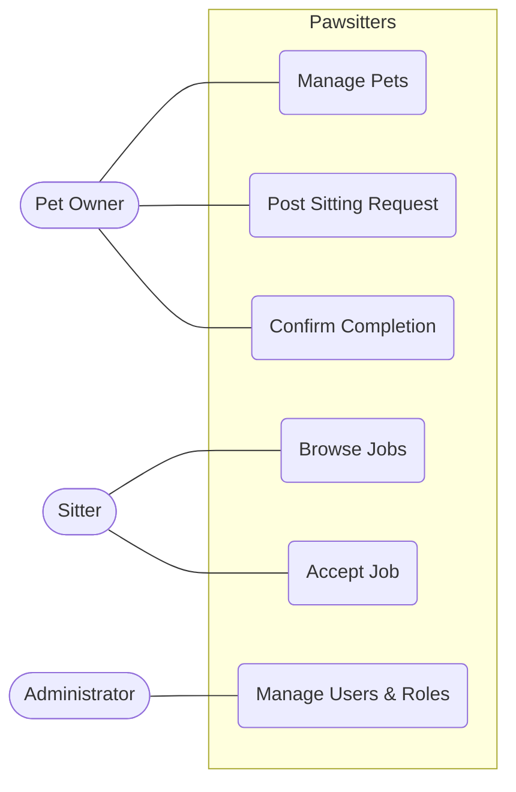
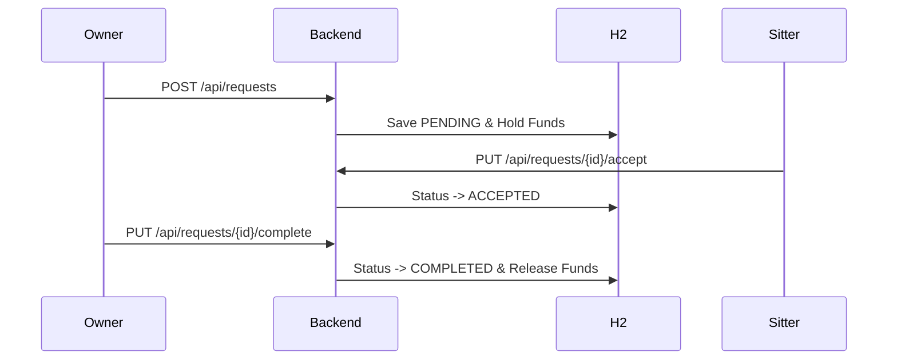

# Pawsitters
### Die Marktplatz-Plattform für Haustierbetreuung
#### Architektur, Sicherheit und moderne Design-Pattern in Spring Boot

---

## Agenda

1.  **Einleitung & Vision**
2.  **Team-Organisation & Prozess**
3.  **Domänenmodell & Architektur (Mermaid)**
4.  **Unit of Work & Repository Pattern**
5.  **Security & Identity Management**
6.  **Finanzielle Integrität (Wallet & Escrow)**
7.  **Qualitätssicherung & Testing**
8.  **Fazit & Lessons Learned**

---

## 1. Team-Organisation & Methodik

- **Initial-Setup:** 
  - 1x Frontend-Entwickler, 2x Backend-Entwickler.
  - Ziel: Schnelle Spezialisierung in den Teilsystemen.
- **Tools:** Konsequente Nutzung von **Kanban-Boards** zur Aufgabensteuerung.
- **Der Strategiewechsel:** 
  - Umstellung auf **Feature-basierte Entwicklung** (Full-Stack).
  - *Erfahrung:* Dies war weniger vorteilhaft als erhofft (Kontextwechsel, Wissenslücken).
- **Learning:** Spezialisierung in frühen Phasen ist oft effizienter; Full-Stack erfordert hohen Abstimmungsaufwand.

---

## 2. Domänenmodell (ER-Logik)

- **AppUser:** Zentraler Knotenpunkt (besitzt Pets, Wallet, Requests).
- **Pet:** Haustier-Entität (Name, Typ, Rasse, Alter).
- **SittingRequest:** Der Marktplatz-Eintrag.
  - Status: `PENDING`, `ACCEPTED`, `COMPLETED`, `CANCELLED`.
- **Wallet:** Virtuelles Konto mit zwei "Töpfen" (Credit vs. Earnings).
- **Payment:** Journal-Eintrag für jede Transaktion.

---

## 3. Architektur: Use Case Diagramm



---

## 4. Architektur: Kontext & Runtime



---

## 5. Der Technologie-Stack

- **Backend:** Java 17 + Spring Boot 3.4
- **Frontend:** Vanilla HTML5, CSS3, JavaScript (ES6+)
- **Datenbank:** H2 In-Memory.
- **Sicherheit:** Spring Security & BCrypt Hashing.
- **Testing:** JUnit 5 (Unit) & Playwright (E2E).

---

## 6. Architektur-Übersicht (Layered MVC)

- **Web-Layer (Controllers):** REST-Schnittstellen.
- **Service-Layer:** Business-Logik (Berechnungen, Regeln).
- **Data Access Layer:** UnitOfWork & Repositories.
- **Vorteil:** "Separation of Concerns".

---

## 7. Deep Dive: Das UnitOfWork-Pattern

- **Zentralisierung:** Ein Einstiegspunkt für alle Datenzugriffe.
- **Effizienz:** Kein Injecting von vielen Repositories in einen Service.
- **Transaktionssicherheit:** Bündelung mehrerer DB-Operationen.
- **Abstraktion:** Services arbeiten mit der UoW, nicht mit JPA-Details.

---

## 8. Code-Vorteil durch UnitOfWork

```java
// Standard Spring Ansatz
@Autowired private PetRepository petRepo;
@Autowired private AppUserRepository userRepo;

// Pawsitters Ansatz (UnitOfWork)
uow.save(newPet);
uow.getRepository(Pet.class).findAll();
```
- **Resultat:** Schlankerer Code, bessere Lesbarkeit.

---

## 9. Security Concept – Identität

- **Passwort-Hashing:** BCrypt (Schutz gegen Brute-Force).
- **Authentication:** Spring Security Filter-Chain.
- **Autorisierung (RBAC):**
  - `ROLE_USER`: Standard-Zugriff.
  - `ROLE_ADMIN`: Administrations-Backend.

---

## 10. Schutz vor OWASP Angriffen

- **Injection:** JPA & Parameterized Queries verhindern SQL-Injection.
- **Broken Access Control:** Serverseitige Rollenprüfung.
- **XSS:** Automatisches Escaping durch den Browser.

---

## 11. Das Wallet & Escrow-Prinzip

- **Hold:** Geld wird reserviert (Status `HELD`).
- **Release:** Nach Bestätigung -> Auszahlung an Sitter.
- **Wallet-Priorisierung:** 
  - Zahlungen nutzen zuerst `Owner Credit`.
  - Danach erst `Sitter Earnings`.
- **Integrität:** UoW garantiert atomare Buchungen.

---

## 12. Frontend Implementation Details

- **api.js:** Zentrales Modul für alle API-Calls.
- **i18n.js:** Mehrsprachigkeit DE/EN.
- **layout.js:** Rollenbasierte UI-Generierung.
- **Session:** LocalStorage-Persistenz.

---

## 13. Administration & Moderation

- **Admin-Dashboard:** Volle Kontrolle.
- **Benutzerverwaltung:** Einsehen und Bearbeiten von Nutzerrollen.
- **Transaktions-Monitor:** Überwachung der Wallet-Bewegungen.

---

## 14. Qualitätssicherung: Unit-Tests

- **JUnit 5 Suite:** Über 35 hochspezialisierte Tests.
- **Happy Path:** Validierung der Standard-Abläufe.
- **Edge Cases:**
  - Login mit falschem Passwort.
  - Doppelte E-Mail Registrierung.
  - Versuch, eigene Requests zu akzeptieren.

---

## 15. Qualitätssicherung: E2E mit Playwright

- **Real-World Szenarien:** Simulation echter Nutzer-Interaktionen.
- **Szenarien:**
  - Registrierung -> Dashboard-Check.
  - Pet anlegen -> Erscheint es in der Liste?
  - Request erstellen -> Validierung.

---

## 16. Cross-Cutting Concepts

- **GlobalExceptionHandler:** Einheitliche JSON-Fehlerstruktur.
- **Data Initializer:** Sofort einsatzbereite Demo-Daten.
- **Clean Code:** Strikte Standards.

---

## 17. Fazit & Lessons Learned

- **Technisch:** Robuster Prototyp mit Enterprise-Architektur.
- **Prozessual:** 
  - Kanban war exzellent für die Übersicht.
  - Team-Spezialisierung (FE/BE) war anfangs effizienter als der spätere Feature-Switch.
- **Ergebnis:** Erfolgreiche Umsetzung eines komplexen Marktplatzes.

---

# Fragen & Antworten
### Vielen Dank für Ihre Aufmerksamkeit!
