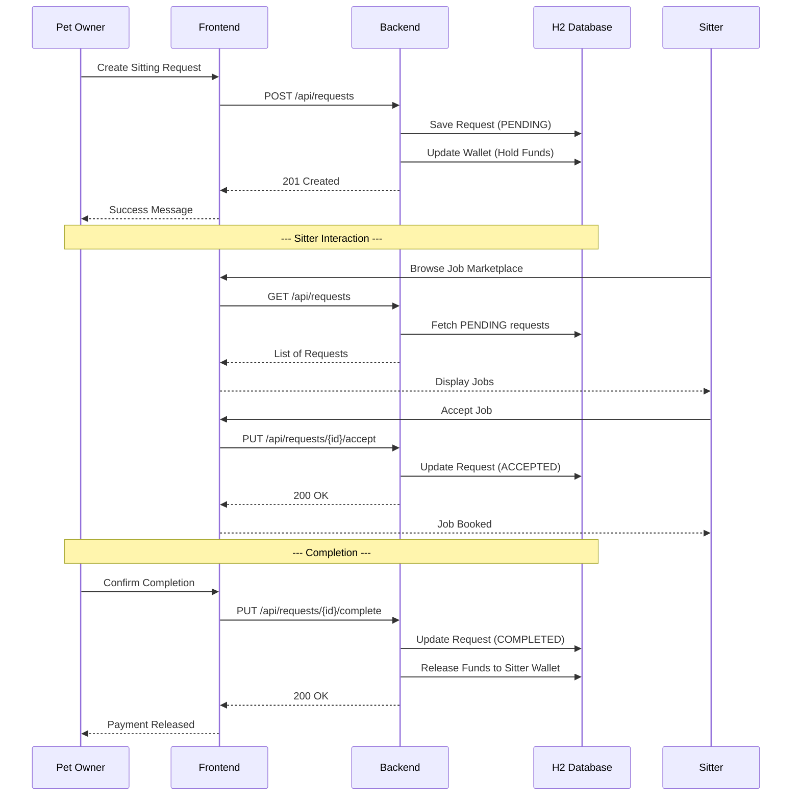

# Arc42 Architecture Documentation - Pawsitters

## 1. Introduction and Goals

Pawsitters is a pet-sitting marketplace designed to connect pet owners with reliable sitters. It operates similarly to platform economies like Airbnb or Uber, specifically tailored for pet care services.

### 1.1 Goals
*   **Marketplace Connectivity:** Facilitate easy discovery of pet sitting opportunities.
*   **Financial Integrity:** Ensure secure handling of funds through a mock escrow system.
*   **User Experience:** Provide a simple, multilingual interface for both owners and sitters.
*   **Role Management:** Support distinct roles (Owner, Sitter, Admin) within a single account.

### 1.2 Stakeholders
*   **Pet Owners:** Want to find trusted sitters and manage their pets.
*   **Sitters:** Want to find jobs and earn money.
*   **Administrators:** Need to oversee the platform, users, and transactions.

## 2. Architecture Constraints

*   **Technology Stack:**
    *   Backend: Java 17, Spring Boot 3.4.
    *   Frontend: Vanilla HTML/CSS/JavaScript (no frameworks/build steps).
    *   Database: H2 In-memory (for development/demo).
*   **Persistence:** All data is ephemeral in the current demo state (lost on restart).
*   **Security:** Basic authentication with BCrypt hashing; session management via `localStorage`.

## 3. Context and Scope

### 3.1 Business Context
The system interacts with users via web browsers. It manages pets, sitting requests, and a virtual wallet system.

### 3.2 Technical Context
```
[User Browser] <--- HTTP/JSON ---> [Spring Boot Backend] <--- JPA ---> [H2 Database]
```

### 3.3 Use Case Diagram
```mermaid
usecaseDiagram
    actor "Pet Owner" as owner
    actor "Sitter" as sitter
    actor "Administrator" as admin

    package Pawsitters {
        usecase "Manage Pets" as UC1
        usecase "Post Sitting Request" as UC2
        usecase "Confirm Completion" as UC3
        usecase "Cancel Request" as UC4
        usecase "Browse Jobs" as UC5
        usecase "Accept Job" as UC6
        usecase "Withdraw Earnings" as UC7
        usecase "Manage Users & Roles" as UC8
        usecase "View Analytics" as UC9
    }

    owner --> UC1
    owner --> UC2
    owner --> UC3
    owner --> UC4
    
    sitter --> UC5
    sitter --> UC6
    sitter --> UC7

    admin --> UC8
    admin --> UC9
```

## 4. Solution Strategy

*   **Monolithic Backend:** A single Spring Boot application handles all business logic, data persistence, and API endpoints.
*   **Layered Architecture:** Strict separation into Controller, Service, and Repository layers.
*   **Unit of Work Pattern:** Centralized entity management and transaction handling to ensure consistency, especially for complex wallet operations.
*   **Vanilla Frontend:** Minimizing complexity by avoiding frontend frameworks, using standard Web APIs and a shared `api.js` for communication.

## 5. Building Block View

### 5.1 Level 1: System Decomposition
*   **Frontend:** Handles user interaction, state management (i18n, session), and UI rendering.
*   **Backend:** Provides RESTful APIs and manages the business domain.

### 5.2 Level 2: Backend Internal Structure
*   **Controllers:** Map HTTP requests to service calls (e.g., `PetController`, `WalletController`).
*   **Services:** Implement business rules (e.g., `SittingRequestService`).
*   **UnitOfWork:** Orchestrates repositories and provides a generic interface for CRUD operations.
*   **Repositories:** Spring Data JPA interfaces for database access.
*   **Models:** JPA Entities representing the domain (User, Pet, SittingRequest, Wallet, Payment).

## 6. Runtime View

### 6.1 Sitting Request Lifecycle


1.  **Post:** Owner creates a request. Funds are "Held" in the wallet.
2.  **Accept:** Sitter accepts the request. Status changes to `ACCEPTED`.
3.  **Complete:** Owner confirms completion. Funds are "Released" to the sitter's earnings.
4.  **Cancel:** Owner cancels a pending request. Funds are "Refunded" to the owner.

### 6.2 Authentication Flow
1.  User submits credentials via `login.html`.
2.  Backend validates against BCrypt hash in `AppUserRepository`.
3.  Backend returns user object (including roles).
4.  Frontend stores user in `localStorage` and updates UI.

## 7. Deployment View

### 7.1 Local Environment
*   Backend: Executed via `./mvnw spring-boot:run` on port 8080.
*   Frontend: Served via any static file server (e.g., `python -m http.server`) on port 5500.

## 8. Cross-cutting Concepts

*   **Security:** Managed via `SecurityConfig` and `BCryptPasswordEncoder`.
*   **Internationalization (i18n):** Implemented in `frontend/js/i18n.js` using a key-value dictionary for EN/DE.
*   **Error Handling:** `GlobalExceptionHandler` ensures consistent JSON error responses for API consumers.
*   **Data Initializer:** A `CommandLineRunner` (`DataInitializer.java`) populates the H2 database with demo users, pets, and requests on startup, ensuring a functional marketplace state for immediate demonstration.

## 9. Architecture Decisions

*   **ADR 1: Use of UnitOfWork Pattern**
    *   *Decision:* Implement a `UnitOfWork` service to wrap repositories.
    *   *Rationale:* Simplifies the service layer by providing a unified entry point for data access and ensures transaction boundaries are respected during complex operations (like multi-bucket wallet updates).
*   **ADR 2: Vanilla JS Frontend**
    *   *Decision:* Avoid React/Angular/Vue.
    *   *Rationale:* Reduces build complexity and ensures the project remains lightweight and easy to understand for educational purposes.
*   **ADR 3: Mock Escrow System**
    *   *Decision:* Track "Held" funds within a `Payment` entity rather than integrating a real payment provider.
    *   *Rationale:* Focuses on business logic and flow without the overhead of external API integrations.

## 10. Quality Requirements

*   **Correctness:** Wallet balances must always reflect the sum of transactions.
*   **Usability:** The interface must be intuitive and support multiple languages.
*   **Security:** User passwords must never be stored in plain text.

## 11. Risks and Technical Debt

*   **In-memory Database:** Data loss on restart is a major risk for non-demo environments.
*   **Client-side Session:** Relying solely on `localStorage` for "auth" status is insecure; true JWT or Cookie-based sessions are needed.
*   **CORS Configuration:** Current permissive `@CrossOrigin("*")` is a security risk in production.

## 12. Glossary

*   **Owner Credit:** Non-withdrawable funds given to users (e.g., signup bonus).
*   **Sitter Earnings:** Funds earned by completing jobs, which can be withdrawn.
*   **Escrow:** A financial arrangement where a third party (the platform) holds funds until a transaction is completed.
*   **Handover Type:** Specifies how the pet is transferred (e.g., Pick-up, Drop-off).
