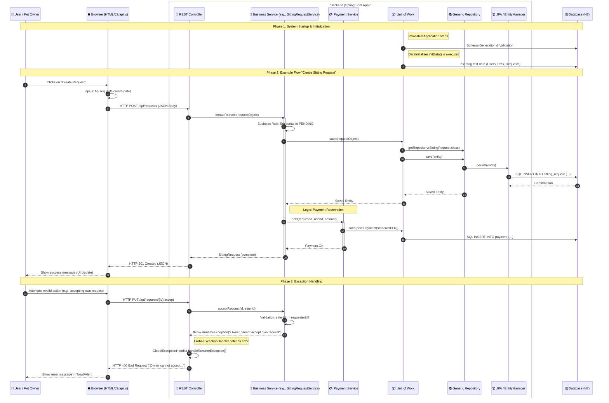

# System Architecture - Flow and Sequence Diagram

This document describes the detailed architecture of **Pawsitters** using a sequence diagram that maps the path of a request from the frontend to the database.

## Technology Stack

### Backend
- **Language/Runtime**: Java 17
- **Framework**: Spring Boot 3.4.1
- **Data Access**: Spring Data JPA / Hibernate
- **Security**: Spring Security (BCrypt for password hashing)
- **Build Tool**: Maven
- **Documentation**: README.md, ARCHITECTURE.md, SECURITY_CONCEPT.md

### Frontend
- **Language**: Vanilla JavaScript (ES6+ Modules)
- **Styling**: CSS3 (Vanilla)
- **Structure**: HTML5
- **Communication**: REST API via Fetch API (`api.js`)

### Infrastructure & Database
- **Database**: H2 (In-Memory for development)
- **Containerization**: Docker & Docker Compose

## Architecture Overview

The application follows a classic layered architecture with the **Unit of Work** pattern in the backend:

1.  **Presentation Layer**: HTML5, CSS3, and Vanilla JavaScript (Browser).
2.  **API Layer**: Spring Boot REST Controllers.
3.  **Service Layer**: Business Logic (Spring Services).
4.  **Persistence Layer**: 
    - **Unit of Work**: Manages repositories and transactions.
    - **Generic Repository**: Abstracts CRUD operations.
    - **JPA / Hibernate**: Object-Relational Mapping.
    - **Database**: H2 (In-Memory) for development.

## Detailed Sequence Diagram

## Component Explanation

### 1. Frontend (Browser)
Uses the `fetch` API encapsulated in `api.js`. Communication is purely asynchronous via JSON. Each page (`dashboard.html`, `pets.html`, etc.) loads specific JS modules that call the API.

### 2. REST Controller
The entry points of the backend. They are kept "thin" and delegate all logic to the services. They use `@CrossOrigin` to allow requests from the frontend server.

### 3. Business Service
This is where the core logic resides (validations, state transitions, linking different domains like Sitting and Payment). They are annotated with `@Transactional` to ensure data consistency.

### 4. Unit of Work & Repositories
- **Unit of Work**: Serves as a central entry point for data access. It prevents services from having to deal directly with the `EntityManager` and enables the dynamic creation of repositories.
- **Generic Repository**: Provides standard methods like `save`, `findById`, `findAll`, and `delete` for all entities without having to write a separate interface for each table.

### 5. Database (H2)
An In-Memory database that is freshly populated from the `DataInitializer` on every restart. This enables fast development and consistent testing environments.

## Security Architecture

The system implements a multi-level security concept:

- **Identity Management**: Authentication via Spring Security. Passwords are stored hashed using **BCrypt**.
- **Authorization**: Role-Based Access Control (RBAC) model with roles such as `ADMIN`, `USER`, `PET_OWNER`, and `SITTER`.
- **Validation**: Double validation in both the frontend (UX) and backend (service level) to ensure data integrity.
- **OWASP Protection**: Protection against SQL Injection through JPA/Hibernate and XSS protection through consistent escaping in the frontend.

## Data Model & Modularization

The backend is divided into clearly separated domain modules:

- **User & Auth**: Management of user accounts, roles, and sessions.
- **Pet**: Management of pet profiles.
- **Sitting**: Core logic for sitter requests and their status.
- **Payment & Wallet**: Processing of payment reservations and virtual credit.
- **Chat**: Real-time communication between pet owners and sitters.
- **Rating**: Rating system for completed assignments.

## Deployment & Project Structure

### Deployment
The application is fully containerized:
- **`backend/Dockerfile`**: Creates an image for the Spring Boot application.
- **`frontend/Dockerfile`**: Uses an Nginx server to serve static files.
- **`docker-compose.yml`**: Orchestrates both services for easy local deployment.

### Project Structure (Excerpt)
- `backend/src/main/java/...`: Java source code (layered model).
- `frontend/`: Static web content (HTML, JS, CSS).
- `docs/`: Architecture and process documentation.
- `e2e-tests/`: Automated end-to-end tests with Playwright.
